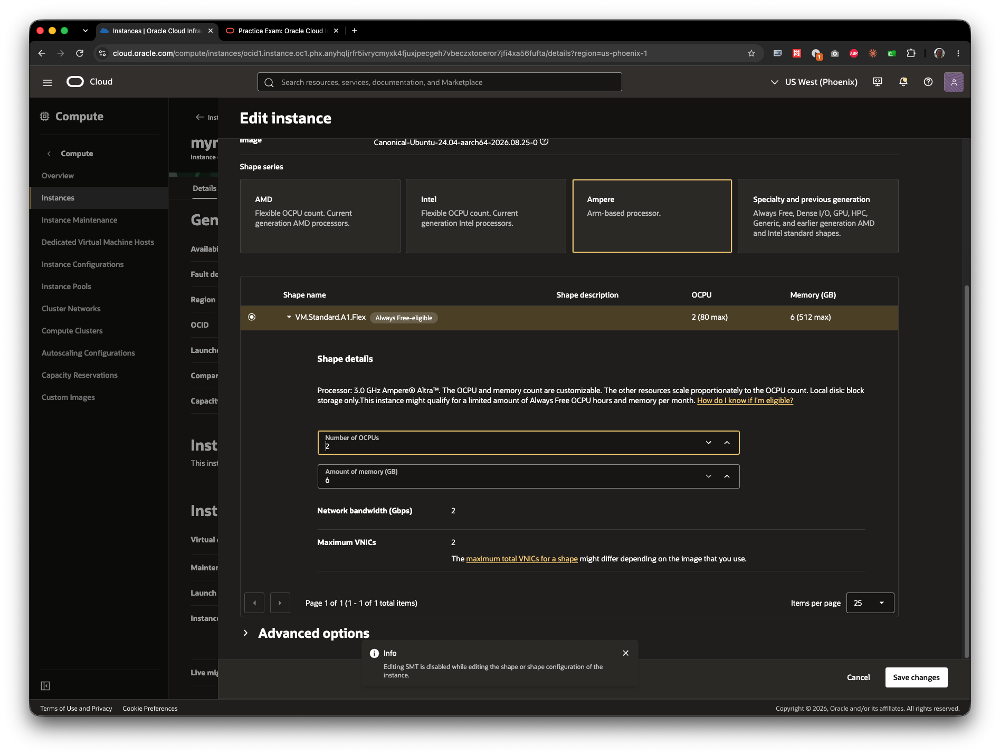

# MyLearn Skill Check Questions — OCI Architect Professional (2026)

#7_mystudy #OCI

*Captured live from MyLearn course skill checks, as taken. Distinct from
[[practice-1-updated]], which is sourced from a Quizlet flashcard set —
keep these separate since they come from different sources.*

**Recurring exam pattern**: several skill-check questions mix real OCI
concepts with fabricated-but-plausible-sounding options. See [[OCI
Architect Professional Tips]] for the full write-up (two distractor
flavors, the five-step prep strategy, and the finite-lists cheat-sheet)
— flagging each instance below as it comes up.

---

## Skill Check: Design Cloud-Native, Microservices, and Serverless Architecture

### Q1
What Kubernetes object can be used to store the Oracle Cloud Infrastructure credentials needed to pull an image from a private registry in OCI?

A. Ingress
B. ConfigMap
C. Secret
D. Service

**Answer: C** (initially selected ConfigMap — incorrect; corrected to Secret before submitting)

*Secret (specifically type `kubernetes.io/dockerconfigjson`) is what stores registry credentials, referenced via `imagePullSecrets` in a pod spec — this is a general Kubernetes concept, not OCI-specific. ConfigMap is for non-sensitive configuration only; it isn't designed for secret material. See [[12. Containers — OCI OKE, Container Instances, OCIR]]'s "Managing OCIR images and security" section for the related kubectl-created registry secret mechanism for private OCIR pulls.*

---

### Q2
As a DevOps Engineer working on an OKE cluster, which file provides you access details to OKE cluster?

A. Kubernetes
B. Kubectl
C. Kube-proxy
D. Kubeconfig

**Answer: D** (selected correctly)

*Matches [[12. Containers — OCI OKE, Container Instances, OCIR]]'s "Accessing a cluster with kubectl" section and the hands-on `oci ce cluster create-kubeconfig --file ~/.kube/config` command run directly against `lab-oke-stack` earlier this session — generated via `oci ce cluster create-kubeconfig`, always lands at `$HOME/.kube/config` regardless of setup path (Cloud Shell vs. local install).*

---

### Q3
As a Cloud Engineer, you are asked to manage the OCI Container Registry, which hosts Docker container images. You are directed to delete all the images within a tenancy region that have not been pulled for over 72 hours to avoid billing charges for the storage space they consume. Which action should you perform to handle this requirement?

A. Periodically delete old, unused images using Docker CLI.
B. Set up local image retention policies to delete images automatically based on selection criteria.
C. Set up a global image retention policy to delete images automatically based on selection criteria.
D. For each old, unused image, select Delete Image from the Actions menu and confirm that you want to delete the image.

**Answer: C** (initially selected B — incorrect; corrected to C before submitting)

*The scenario's "within a tenancy region" scope is the tell — a global image retention policy applies to all repositories in a region by default. Verified against Oracle's docs directly (docs.oracle.com/en-us/iaas/Content/Registry/Tasks/registrymanagingimageretention.htm): the answer choices' term "local" is not the real OCIR term — Oracle's actual second policy type is called **custom**, scoped to specific repositories explicitly added to it (one custom policy per repo at a time), not "local." See [[12. Containers — OCI OKE, Container Instances, OCIR]]'s "Lifecycle/retention policies" section for the corrected terminology.*

---

### Q4
You work as a DevOps engineer and are responsible for managing the container images stored in your team's Oracle Cloud Infrastructure Registry (OCIR) repository. One of your team members accidentally deletes an important container image from the repository. You need to recover the image as soon as possible. How long do you have to undelete the image from OCIR before it is permanently deleted?

A. 72 hours
B. 24 hours
C. 48 hours
D. 96 hours

**Answer: C** (initially selected B — incorrect; corrected to C before submitting)

*Verified against Oracle's docs directly (docs.oracle.com/en-us/iaas/Content/Registry/Tasks/undelete-image.htm): "You can undelete an image you've previously deleted, for up to 48 hours after you deleted it. After that time, the image is permanently removed from Container Registry." Restore via `oci artifacts container image restore --image-id <image-ocid>`. See [[12. Containers — OCI OKE, Container Instances, OCIR]]'s "Managing OCIR images and security" section for the corresponding delete/undelete coverage.*

---

## Result: Passed — 100% (4/4)

Two of four questions had an incorrect answer selected initially and were
corrected before submitting (Q1: ConfigMap → Secret; Q3: local → global
retention policy) — worth a review pass on OCIR retention policy
terminology (Global vs. Custom, not "Local") and Kubernetes Secret vs.
ConfigMap scope before the real exam.

---

## Skill Check: Deliver Infrastructure-as-code

### Q1
Your team lead has provided you with a Terraform configuration which includes variables (but not limited to) OCIDs, IP addresses, and CIDR blocks. You have been tasked with using Resource Manager to provision many versions of the environment with different values for some of these variables. Which two statements are true? **Select TWO correct answers.**

A. For each environment, you need to create a terraform.tfvars file that defines the variables. When you provision each stack, supply the respective variables file.
B. Resource Manager can automatically populate some variable values.
C. For each environment, you need to create a separate Terraform configuration with variables replaced by literals.
D. When you provision a stack, Resource Manager provides fields in the console to define all variables.
E. A schema document can be used to declare each of these environments and define the variables for each of them.

**Answer: B, D** (selected correctly)

*Directly matches the hands-on Resource Manager work done this session with `lab-network-stack`/`lab-nsg-stack`/`lab-func-stack` — the Configure Variables Console screen (option D) and Resource Manager's ability to auto-derive some OCID-type values via native pickers/data sources (option B). Option A describes the local-Terraform `.tfvars` workflow used for `lab-private-network-stack` onward, not Resource Manager's own variable-input model — a real, exam-relevant distinction between the two workflows this session used both of.*

---

### Q2
Which feature of the OCI Resource Manager service will you use to differentiate between the real-world state of your infrastructure and the stack's last executed configuration?

A. View State
B. Diff Detection
C. Apply or Import State
D. Drift Detection

**Answer: D** (selected correctly)

*Compares real-world provisioned infrastructure against the stack's last-executed Terraform configuration, surfacing manual/out-of-band changes made outside Terraform. Distinct from Apply (runs config forward) and Import State (brings existing resources under Terraform management) — drift detection diagnoses divergence, it doesn't fix it. Note "Diff Detection" (option B) is a plausible-sounding distractor, not the real Oracle term. See [[8. Management and Governance — OCI Resource Manager, OS Management Hub, Observability]]'s "Infrastructure as code" section, now expanded with this precise definition.*

---

### Q3
As a DevOps Engineer you have created a Terraform configuration for an infrastructure automation project on the OCI platform. You have been tasked with using OCI Resource Manager to automate the process of provisioning your OCI resources. Which two things happen when you apply Terraform configuration? **Select TWO correct answers.**

A. Terraform corrects formatting errors in your configuration.
B. Terraform makes any infrastructure changes defined in your configuration.
C. Terraform updates the state file with any configuration changes it made.
D. Terraform gets the plugins that the configuration requires.
E. Terraform destroys and recreates all your infrastructure from scratch.

**Answer: B, C** (selected correctly)

*Directly observed dozens of times this session across every `terraform apply` run in `terraform/` — infrastructure changes applied, `.tfstate` updated to match. The three distractors each belong to a different command: A is `terraform fmt`, D is `terraform init`, E is `terraform destroy` (a normal `apply` can still force a full resource *replacement* for a single resource when a change requires it — e.g. adding `nsg_ids` forced `lab-oke-stack`'s node pool to recreate — but that's targeted replacement, not "all infrastructure from scratch").*

---

### Q5
You are a DevOps engineer and as part of hybrid cloud infrastructure automation for a new project, you have been tasked to create Terraform stacks using Oracle Cloud Infrastructure (OCI) Resource Manager. Which two statements about Terraform are **FALSE**? **Select TWO correct answers.**

A. You configure multiple provider instances with the help of an alias.
B. Terraform CLI versions and provider versions are independent of each other.
C. Terraform is an IaaS.
D. Resource names in Terraform are provider specific.
E. Terraform codifies cloud APIs into declarative configuration files.

**Answer: C, D** — confirmed by MyLearn's own grading (initially selected A, C — A was marked incorrect; corrected pair per the grader is C and D)

*A real, non-obvious trap in the wording of D — worth understanding exactly why it's false, not just memorizing it: Terraform's `resource "<TYPE>" "<NAME>" {}` syntax has two separate naming layers. The resource **type** (e.g. `oci_core_vcn`, `oci_containerengine_cluster`) genuinely is provider-namespaced — this session's code used the `oci_` prefix on every single resource. But the resource **name** (e.g. `"lab_vcn"` — the local identifier you invent to reference the resource elsewhere in config) is entirely arbitrary, chosen by the author, and has nothing to do with the provider. D conflates these two layers — "resource names" (plural, generic) reads as the type prefix, but Terraform's own docs distinguish type from name precisely because the name is never provider-specific.

C ("Terraform is an IaaS") is false for a category reason: Terraform is IaC (Infrastructure as **Code**) tooling — it calls a provider's APIs to create/manage infrastructure, but provides no infrastructure of its own. IaaS (Infrastructure as a **Service**, e.g. OCI Compute) means the provider hosts infrastructure you consume; Terraform hosts nothing — stopping Terraform doesn't remove any resources it created, since it was never the thing running them.

A ("alias") and B (CLI/provider version independence) are both **true**, confirmed directly from this session's own `main.tf` files (`provider "oci" { alias = "home" }` used in `lab-storage-stack`/`lab-oke-official-module-stack`; `required_version` and `required_providers { oci = { version = ... } }` are separate, uncoupled fields in every stack) and cross-checked against HashiCorp's own docs on CLI/provider version independence before submitting.*

---

## Result: Not fully recorded

Q4 was never captured (this deck jumps Q3 → Q5), and no final pass/fail
score or percentage was recorded for this skill check — unlike the other
three. Q5 is confirmed as a MyLearn-graded miss (initially selected A, C;
corrected to C, D). Flagged here rather than guessed — if this skill check
is retaken, capture the full result and all five questions.

---

## Skill Check: Design Scalable and Elastic Solutions for High Availability and Disaster Recovery

### Q1
Which are the two main metrics to measure the effectiveness of a Disaster Recovery setup? **Select TWO correct answers.**

A. Mean Time to Recover (MMTR)
B. Minimum Time to Recover (MITR)
C. Recovery Point Objective (RPO)
D. Recover Time Objective (RTO)

**Answer: C, D** (selected correctly)

*RPO (how much data loss is acceptable — how far back in time) and RTO (how long the outage can last before recovery) are the standard pair of DR-effectiveness metrics, already the backbone of the design reasoning in [[Lab 2 - OCI Architect Pro Exam - HADR Design]] — e.g. that lab's RPO-near-zero requirement is exactly what justified choosing Data Guard over backup-only for the database tier. A and B are not standard DR-effectiveness terminology.*

---

### Q2
Which Disaster Recovery strategy provides data protection and availability for Oracle Database by maintaining an exact physical replica of the production copy at a remote location that is open read-only while replication is active?

A. Physical Standby
B. Active Data Guard
C. Golden Gate
D. Oracle Streams

**Answer: B** (selected correctly)

*Verified against Oracle's docs (blogs.oracle.com/ebstech and database-heartbeat.com corroborating). A real licensing distinction, not just naming overlap: a plain **Physical Standby** can be opened read-only, but only if redo apply is stopped first — replication and read-only access are mutually exclusive without the add-on. **Active Data Guard** is the licensed option that specifically allows read-only access **while redo apply keeps running simultaneously**. The question's exact phrasing ("open read-only while replication is active") is the tell that distinguishes B from A. See [[6. Databases — OCI Database, NoSQL, Caching, DR]]'s "Availability, read scale, and recovery" table, now updated with this distinction.*

---

### Q3
Which two statements about availability domains (AD) are true? **Select TWO correct answers.**

A. They provide high availability for application resources within a fault domain.
B. One region can have only one AD.
C. A regional subnet can be shared between two ADs.
D. Multiple ADs will never share physical infrastructure.

**Answer: C, D** (selected correctly)

*A's relationship is inverted — the real hierarchy is Region → Availability Domains → Fault Domains, so it's fault domains that isolate *within* an AD, not ADs providing HA within a fault domain. B is false as an absolute claim since region AD-count varies (1 or 3 depending on the region). C matches this session's own hands-on work directly — `lab-network-stack`'s subnet is regional, spanning every AD in the region, exactly as shown in the three-tier HA diagram in [[9. Networking — OCI VCN, DRG, Gateways, Load Balancers]]. D is the core definition of an AD: physically isolated data center with independent power/cooling/networking.*

---

### Q4
How many Fault Domains does one Availability Domain contain?

A. Two
B. Three
C. Four
D. One

**Answer: B** (selected correctly)

*A fixed number, not something that varies — every AD always has exactly 3 fault domains, regardless of region or AD count. This is why 3-way spread patterns show up repeatedly across OCI HA designs (e.g. the three-tier reference diagram in [[9. Networking — OCI VCN, DRG, Gateways, Load Balancers]]). See [[3. Compute — OCI Compute, Instance Pools, Load Balancers, Volumes]]'s "High availability and scaling" section, now updated with this exact count.*

---

### Q5
Which three key elements should be considered when designing high availability architecture? **Select THREE correct answers.**

A. Scalability
B. Monitoring
C. Redundancy
D. Failover
E. Virtualization

**Answer: B, C, D (Monitoring, Redundancy, Failover)** — selected A, C, D
(Scalability instead of Monitoring); this was the one miss on this skill
check (4/5 overall).

*Corrects my own in-session reasoning: I argued Monitoring was merely a
supporting/observability concern rather than a core HA pillar, and treated
Scalability as one of the three — MyLearn's grading says the opposite.
Oracle's framing here treats **Monitoring** (detecting failures/performance
issues in real time) as a first-class HA design pillar alongside
**Redundancy** (duplicating critical components so backups exist) and
**Failover** (the mechanism for switching to that backup — the Layer 1/Layer
2 Switchover-Failover distinction already worked out in
[[Lab 2 - OCI Architect Pro Exam - HADR Design]]). Scalability is a related,
important design concern but wasn't one of *these three* per this question's
intended framing — worth remembering that "important to HA" and "one of the
three canonical HA pillars this specific question wants" aren't always the
same list.*

---

## Result: 4/5 (80%)

Only miss was Q5 (Monitoring vs. Scalability as a core HA pillar) — worth a
review pass on Oracle's specific framing of HA design pillars
(Redundancy/Failover/Monitoring) before the real exam, since it doesn't
exactly match the more generic "scalability + resilience" framing that
feels intuitive coming from general cloud-architecture reasoning.

---

## Skill Check: Architect Security Solutions

### Q1
Which type of rule do you need to configure in OCI WAF to protect your web applications from various types of threats such as SQL injection, cross-site scripting, and HTML injection?

A. Bot Management
B. Rate Limiting rule
C. Protection rule
D. Access control rule

**Answer: C** (selected correctly)

*Matches [[5. Security — OCI IAM, WAF, Certificates, Vault, Cloud Guard]]'s WAF taxonomy directly — protection rules are the Input-Injection Attacks category (SQLi, XSS, LFI, RCE), distinct from access control rules (allow/deny/challenge by IP/geo/header/method) and Bot Management/rate limiting (the Bot & Automation and Layer 7 Volumetric & Abuse categories respectively). The question's three named threats (SQLi, XSS, HTML injection) are all squarely Input-Injection — the tell pointing straight at Protection rule.*

---

### Q2
Which statement best explains why a dynamic group is needed for Certificate Authority creation in OCI Certificate service?

A. A dynamic group is necessary to manage the Certificate Authority's revocation list.
B. A dynamic group is necessary to create TLS certificates after the Certificate Authority is created.
C. A dynamic group is not necessary for creating a Certificate Authority.
D. A dynamic group is necessary to allow the Certificate Authority to make API calls to vault or object storage services.

**Answer: D** (initially selected B — incorrect; corrected to D before submitting)

*A real, live-confirmed fact, not just a plausible-sounding option: a genuine tenancy Console screen showed a dynamic group named `OCI-SM-CA-DG`, described as "Dynamic Group for the Certificate Authority" — proof the CA itself needs resource-principal-style access to call other OCI services (Vault/KMS specifically, to reach its signing key) on its own behalf, the same pattern used for compute instances/Functions accessing buckets. B describes an unrelated, not-quite-coherent relationship (a dynamic group needed by a human to create certs afterward). This is the exact same unresolved authorization gap `terraform/LABS.md`'s `lab-mymagnet-stack` entry documents at length: real CA creation attempts against a real KMS key failed with "Authorization failed... Key Id..." even after two different IAM policy grants — a live, hands-on confirmation of the concept this question tests, not just abstract terminology. See [[5. Security — OCI IAM, WAF, Certificates, Vault, Cloud Guard]]'s dynamic-group-for-CA note.*

---

### Q3
Which Oracle Cloud Service provides restricted and time-limited secure access to resources that don't have public endpoints?

A. SSL certificate
B. Bastion
C. Load balancer
D. Internet Gateway

**Answer: B** (selected correctly)

*Matches [[5. Security — OCI IAM, WAF, Certificates, Vault, Cloud Guard]]'s "OCI Bastion service vs. a self-managed bastion host" section directly — restricted, time-limited (session-bound) secure access to private resources with no public endpoint, without exposing them via a public IP/jump host of your own.*

---

### Q4
Suppose you have a network firewall policy with two decryption rules and three security rules, each with a unique priority number. A packet arrives at the firewall, and the firewall inspects it according to the policy rules. Which scenario occurs?

A. The firewall evaluates the security rules first, then evaluates the decryption rules, and drops the packet if no rule matches the packet information.
B. The firewall evaluates the decryption rules first, applies the specified rule action if a match is found, and drops the packet if no decryption rule matches the packet information.
C. The firewall evaluates the decryption rules first, applies the specified rule action if a match is found, and then evaluates the security rules in priority order. If a security rule matches, the specified rule action is applied and no further rules are evaluated. If no security rule matches, the packet is dropped.
D. The firewall evaluates the security rules first, applies the specified rule action if a match is found, and then evaluates the decryption rules in priority order. If a decryption rule matches, the specified rule action is applied and no further rules are evaluated. If no decryption rule matches, the packet is dropped.

**Answer: C** (initially selected D — incorrect; corrected to C before submitting)

*Directly contradicts the four-stage pipeline documented in [[5. Security — OCI IAM, WAF, Certificates, Vault, Cloud Guard]]'s "How the Network Firewall processes every packet" section: **Decryption Rules evaluate first** (so encrypted threats are inspectable before anything downstream looks at them), **then Security Rules** (which drop unmatched traffic — the firewall's own internal default-deny), then Tunnel Inspection, then NAT last. D reverses stages 1 and 2. C is the only option matching the documented order, including the correct default-deny behavior at the security-rules stage ("if no security rule matches, the packet is dropped").*

---

### Q5
Which statement is MOST accurate about Oracle Cloud Infrastructure (OCI) Dedicated Key Management Service (DKMS)?

A. DKMS offers a lower level of security compared to a private vault.
B. DKMS requires using OCI APIs for all cryptographic operations.
C. DKMS offers a shared HSM partition managed by Oracle.
D. DKMS allows full control over keys and the underlying HSM partitions.

**Answer: D** (initially selected C — incorrect; corrected to D before submitting)

*Inverts the core differentiator documented in [[5. Security — OCI IAM, WAF, Certificates, Vault, Cloud Guard]]'s "Dedicated Key Management" section: Dedicated KMS's first named benefit is explicitly **"Full Control"** — a fully managed, **single-tenant** HSM partition with exclusive access, the opposite of a shared partition. C describes the regular (`DEFAULT`) shared-vault model, not Dedicated KMS's whole point. B is also wrong — Dedicated KMS's differentiator is industry-standard interfaces like **PKCS#11** specifically so applications can talk directly to the HSM *without* going through OCI APIs, per the same section.*

---

## Result: Passed — 100% (5/5)

Three of five questions had an incorrect answer selected initially and were corrected before submitting (Q2: B → D; Q4: D → C; Q5: C → D) — a 40% initial-miss rate despite the final 100%, and all three misses were on material already written up in Note 5 before taking this skill check. Added to the certification plan's "Top 10 items to review" list: the Network Firewall pipeline order (Decryption → Security → Tunnel Inspection → NAT), Dedicated KMS's single-tenant/full-control value prop (not shared), and the dynamic-group-for-CA purpose — the last one doubling as live confirmation of the exact concept behind `lab-mymagnet-stack`'s still-unresolved Certificate Authority authorization bug.

---

## Skill Check: Autonomous Database

*Prior attempt on this skill check showed "Highest score: 40%" in the playlist sidebar before this retake — see [[6. Databases — OCI Database, NoSQL, Caching, DR]] for the full underlying notes.*

### Q1
Which three are inputs provided when provisioning an Autonomous Database?

A. Deployment type
B. Name of superuser
C. Network access type
D. Compute model and shape
E. Workload type

**Answer: A, C, E** (attempt 1: selected B, C, D — incorrect; attempt 2: corrected to A, D, E — still incorrect, D flagged wrong; final correct answer is A, C, E)

*Platform feedback, verbatim: "While provisioning in the Console, you provide the display name, type of network access, type of workload, the type of deployment, version, license type, encryption type, etc." — **Compute model and shape (D) is NOT one of the intended three**, contradicting my own first read of this question. [[6. Databases — OCI Database, NoSQL, Caching, DR]] does correctly document compute model as chosen at provisioning and locked afterward (confirmed separately during the Cloning demo) — that fact isn't wrong, but it isn't one of the three inputs *this specific question* is built around. The real three are deployment type, network access type, and workload type. **A genuine, confirmed miss** — flagged for the Top 10 review list. Worth double-checking Note 6's provisioning section doesn't overstate compute model's centrality relative to network access type in this specific "which inputs" framing.*

---

### Q2
Which two of these are supported deployment options for an Autonomous Database?

A. Azure HPC
B. Dedicated Exadata infrastructure in AWS
C. Oracle Dedicated Region Cloud@Customer
D. OCI Public Cloud

**Answer: C, D** (selected correctly)

*A and B are fabricated distractors — Autonomous Database has no native deployment option on Azure or AWS infrastructure. **Trick worth flagging**: this question's four answer choices only surface 2 of the **4 real** documented deployment options ([[6. Databases — OCI Database, NoSQL, Caching, DR]]'s "Autonomous Database deployment options — four, not two" section: Serverless, Dedicated, Exadata Cloud@Customer, and Dedicated Region Cloud@Customer). "OCI Public Cloud" as an answer choice is not itself a named Oracle deployment-option term — it's a loose stand-in for Serverless/Dedicated running in a standard public OCI region, used here purely to distinguish from the on-premises Cloud@Customer option. Don't let this question's simplified two-option framing overwrite the real four-option taxonomy when studying — Exadata Cloud@Customer and Serverless-vs-Dedicated distinctions are still real, separately examinable facts this question doesn't test.*

---

### Q3
Which workload type should you choose while provisioning an Autonomous Database for a supply chain customer that needs to purpose the database, to record daily transactions and then run an EOD job as part of data consolidation?

A. Autonomous Data Warehouse
B. Autonomous Transaction Processing
C. Autonomous Blockchain Database
D. Autonomous JSON Database

**Answer: B** (selected correctly)

*Platform feedback, verbatim: "Workload types are ATP, ADW, AJOD, APEX" — note the platform's own feedback text spells the JSON workload type **"AJOD"** here, vs. **"AJD"** used consistently in [[6. Databases — OCI Database, NoSQL, Caching, DR]] — likely a typo in MyLearn's own copy rather than a different real service, but flagging the naming variance in case it recurs. **Autonomous Blockchain Database (C) is a fabricated distractor** — not one of the real four workload types (ATP/ADW/AJD/APEX). Recording daily transactions is textbook OLTP; the EOD consolidation job doesn't push this to ADW — ATP is designed to handle mixed transactional + light batch/reporting workloads without a separate warehouse.*

---

### Q4
Which two statements about Autonomous Database provisioning are true?

A. Autonomous Database is provisioned as a pluggable database.
B. Customer configures and manages the Exadata hardware before they can provision the Autonomous Database.
C. Autonomous Database is automatically provisioned in Oracle-managed Exadata hardware.
D. Autonomous Database is provisioned in Oracle Shards configured with high availability and fault tolerance.

**Answer: A, C** (attempt 1: selected C, D — incorrect; attempt 2: corrected to A, C — correct)

*Platform feedback, verbatim: "Autonomous Database is provisioned in Exadata hardware and each autonomous database is a pluggable database following multitenant architecture." **D is a fabricated-scope distractor**: it describes Globally Distributed Autonomous Database (sharding), a separate, opt-in service — NOT what happens automatically during standard Autonomous Database provisioning (see [[6. Databases — OCI Database, NoSQL, Caching, DR]]'s "Globally Distributed Autonomous Database — sharding architecture" section). **B is also wrong** and directly contradicts the "fully managed" premise — Oracle always owns/manages the Exadata hardware layer, in both Serverless and Dedicated deployment; even Dedicated's isolation is at the logical (ACD/ADB) level, not physical hardware control. **Real architectural fact confirmed by this question**: every Autonomous Database instance, regardless of deployment mode, runs on Exadata infrastructure — the Serverless/Dedicated distinction is about who owns/manages that Exadata (shared multi-tenant vs. a dedicated Exadata Infrastructure resource), not whether Exadata is used at all.*

---

### Q5
Which are the three allowed network access configurations available for Autonomous Database on shared infrastructure?

A. Private endpoint access only
B. Secure access from everywhere
C. Access only from OCI peered VCNs
D. Secure access from allowed IP and VCNs only

**Answer: A, B, D** (attempt 1: selected A, C, D — incorrect; attempt 2: corrected to A, B, D — correct)

*Platform feedback, verbatim: "Private endpoint access only, Secure access from allowed IP and VCNs only, Secure access from everywhere are the three network access types available for you to choose when provisioning Autonomous Database in shared infrastructure." Matches [[6. Databases — OCI Database, NoSQL, Caching, DR]]'s Serverless Provisioning network access tiers exactly. **"Access only from OCI peered VCNs" (C) is a fabricated distractor** — not one of the three real named tiers; don't confuse it with the real "allowed IPs and VCNs" tier (D), which does restrict by VCN among other criteria but isn't phrased or scoped as "peered VCNs only."*

---

## Result: Passed — 80% (4/5)

One question (Q1) had a **confirmed, uncorrected miss**: selected "Compute model and shape" instead of "Network access type" as one of the three core provisioning inputs, even after a first correction attempt. Three other questions (Q2, Q4, Q5) each involved at least one fabricated-but-plausible distractor mixed among real OCI concepts — see the "Recurring exam pattern" note at the top of this file and [[OCI Architect Professional Tips]] for the consolidated study strategy against this. This is a real, substantial improvement from the prior attempt's "Highest score: 40%." Added to the certification plan's "Top 10 items to review" list: the exact three Autonomous Database provisioning inputs (deployment type, network access type, workload type — NOT compute model/shape), and a reminder to re-verify Note 6's provisioning section framing against this platform feedback.

---

## Official Prep Workshop Sample Questions (Oracle University, "Prepare for OCI Architect Professional Certification")

*Source: MyLearn course [163275](https://mylearn.oracle.com/ou/course/prepare-for-oracle-cloud-infrastructure-architect-professional-certification/163275/273240), Part 2 transcript. Presented by instructor Samvit Mishra (Senior Manager, Oracle University), explicitly framed as **sample questions emulating the test format** — not real exam questions — used to teach the keyword-identification and elimination strategy. One question per exam domain. Distinct from the skill-check questions above (those are per-module MyLearn skill checks with your own answer attempts; these are Oracle's own worked examples with the instructor's reasoning, no attempt/miss data since you didn't answer them live).*

### Q1 — Architect High Availability and Disaster Recovery Solutions
Your organization runs a critical e-commerce application in an OCI region. Due to an unexpected natural disaster affecting the primary region, you need to quickly switch operations to a disaster recovery region with minimal downtime. Which OCI Full Stack Disaster Recovery feature helps achieve this?

A. Manual reconfiguration of DNS and resource settings
B. Manually creating snapshots of individual resources
C. Writing custom scripts for disaster recovery workflows
D. Automated failover of the complete application stack to the DR region

**Answer: D**

*Instructor's reasoning: the scenario's keyword is "minimal downtime." Options A–C all describe manual effort (reconfiguration, snapshots, custom scripts), which directly contradicts minimal downtime. Full Stack DR's actual value proposition is automating disaster recovery across the entire application stack — the keyword in D ("automated failover of the complete application stack") is the direct match.*

### Q2 — Architect Cloud-Native Solutions
As a cloud architect, you are designing a secure solution for managing and deploying containerized applications on OCI. Your development team needs to push and pull container images using Docker CLI with OCI Container Registry. Which authentication method should be used to securely access the private OCI Container Registry?

A. Configure a master encryption key in OCI Vault
B. Set up an SSH key pair
C. Generate and use an auth token
D. Use a JSON Web Token

**Answer: C**

*Instructor's reasoning: OCIR uses auth tokens for secure authentication when accessing private repositories through Docker CLI — generated from the user's OCI profile, used alongside the username during `docker login`. This provides secure, token-based authentication without exposing the OCI account password. Cross-reference: matches the real OCIR auth-token mechanism already documented in [[12. Containers — OCI OKE, Container Instances, OCIR]].*

### Q3 — Architect Security Solutions
You are designing a secure access solution for compute instances located in a private subnet. According to your organization's security requirements, these compute instances must not have direct access to the internet, and administrative access must be tightly controlled. Which statement correctly explains the purpose of OCI Bastion in this scenario?

A. It provides a public endpoint directly on the compute instance for remote administration.
B. It offers a secure, controlled public entry point for accessing resources located in a private subnet.
C. It functions as a firewall that blocks all external traffic to the private compute instances.
D. It acts as an additional authentication service that validates user credentials before instance access is granted.

**Answer: B**

*Instructor's reasoning: eliminate A ("public endpoint" directly on the instance defeats the "no direct internet access" requirement), C (Bastion isn't a firewall), and D (it isn't a credential-validation/auth service). OCI Bastion's real mechanism: secure access to private-subnet compute instances — without those instances needing public IPs or direct internet exposure — via a managed, controlled access mechanism (SSH port forwarding or session-based access) through a secure entry point.*

### Q4 — Architecting, Implementing, and Operating Databases in OCI
Your organization is evaluating Oracle Database Autonomous Recovery Service as part of its disaster recovery and backup strategy for Oracle databases. Which underlying technology is Oracle Database Autonomous Recovery Service built upon?

A. Oracle Data Guard
B. Oracle Recovery Manager (RMAN)
C. Oracle Zero Data Loss Recovery Appliance
D. Oracle GoldenGate

**Answer: C**

*Instructor's reasoning: a direct fact rather than an elimination exercise — Autonomous Recovery Service (ARS) is built on **Zero Data Loss Recovery Appliance** technology, delivering automated cloud-based backup/recovery designed for highly efficient backups, rapid recovery, and near-zero data loss protection. **Don't confuse this ARS (the general Oracle Database backup service covering Base DB, Exadata Database Service, Autonomous Database Dedicated, and multicloud) with Zero Data Loss Autonomous Recovery Service (ZRCV)** — the Autonomous-Database-specific, extra-cost, sub-second-RPO tier documented separately in [[6. Databases — OCI Database, NoSQL, Caching, DR]]. Same underlying ZDLRA technology lineage, but ARS and ZRCV are two distinct named services.*

### Q5 — Implementing Observability Solutions
Your organization uses OCI Connector Hub to move logs from OCI Logging to OCI Object Storage. To reduce storage consumption and keep only relevant data, you want to transfer only logs that contain error-level events. Which OCI Connector Hub feature should you configure to accomplish this requirement?

A. Agent configuration
B. Log filter task
C. Tags
D. IAM policies

**Answer: B**

*Instructor's reasoning: a **log filter task** in Connector Hub filters/processes logs before they're transferred to the target service (here, Object Storage) — configuring one ensures only error-level logs are forwarded, reducing storage and improving the relevance of what's retained. The other three options don't operate on log content/severity at all: agent configuration governs collection agents, tags are metadata/organization, and IAM policies control access — none of them filter by log level.*

## Test-taking strategy demonstrated across all five (see [[OCI Architect Professional Tips]] Section 1 for the full write-up)
- Identify the scenario's **keyword(s)** first — each question above hinges on one or two words ("minimal downtime," "private," "error-level events") that immediately eliminate options not addressing that specific constraint.
- **Process of elimination** beats trying to recall the "right" answer directly — three of the five worked examples (Q1, Q2, Q3) are explicitly solved by ruling out wrong options rather than recognizing the correct one on sight.
- Watch for options that **sound plausible but describe manual/partial mechanisms** when the scenario asks for something automated/complete (Q1's A–C), or that invoke a real OCI concept in the wrong role (Q3's firewall/auth-service mischaracterizations of Bastion) — the same fabricated-plausible-distractor pattern already flagged at the top of this file for the skill-check questions.

---

## Practice Exam 997-26 (MyLearn, 50 questions, timed, live attempt)

*Source: [Practice Exam: Oracle Cloud Infrastructure Architect Professional](https://mylearn.oracle.com/ou/course/practice-exam-oracle-cloud-infrastructure-architect-professional/163237/271344) — a full 50-question timed mock exam, distinct from the per-module skill checks and the workshop's 5 sample questions above. Captured live, question by question, as taken; correct answers verified against Oracle's official documentation where not already covered in these notes (cited inline), since this practice exam doesn't show correct-answer explanations inline the way skill checks do.*

### Q1 — OKE / kubectl cluster access (multi-select, choose TWO)
You are configuring access to an OCI Container Engine for Kubernetes (OKE) cluster using kubectl. Which TWO statements are correct regarding the configuration required to access the cluster?

A. To access the cluster using kubectl, you have to set up a Kubernetes configuration file for the cluster. The kubeconfig file by default is named `config` and stored in the `$HOME/.kube` directory.
B. You cannot set up Cloud Shell access to the cluster if the cluster's Kubernetes API endpoint has a private IP address.
C. When a cluster's Kubernetes API endpoint has a public IP address, you can access the cluster in Cloud Shell by setting up a kubeconfig file.
D. To access the cluster using kubectl, you have to set up a Kubernetes manifest file for the cluster. The kubeconfig file by default is named config and stored in the `$HOME/.manifest` directory.
E. Generating an API signing key pair is a mandatory step while setting up cluster access using a local machine if the public key is not already uploaded in the console.

**Your answer: B, C — Confirmed CORRECT**, verified directly against Oracle's docs (Setting Up Cluster Access / Accessing a Cluster Using Kubectl). Cloud Shell access to an OKE cluster requires a **public** Kubernetes API endpoint; a private endpoint blocks direct Cloud Shell access entirely (Bastion tunneling is the documented workaround, not covered by this question's options). A is a plausible-sounding near-miss — the real kubeconfig default location is `$HOME/.kube/config`, not what A/D describe once you check A's own wording matches the real fact but wasn't selected as one of the two (only two answers required, and B+C are the ones the question is testing). D is a fabricated distractor (`$HOME/.manifest` isn't real). **Added to [[12. Containers — OCI OKE, Container Instances, OCIR]]'s "Accessing a cluster with kubectl" section.**

### Q2 — Compute / Instance Pool Autoscaling
An e-commerce company is running on OCI and many compute instances remain unused for most of the year except during Black Friday and Christmas. You suggest they use OCI's Autoscaling feature and present a slide showcasing its features. Which option is accurate in your presentation to the customer?

A. Autoscaling requires an instance pool as a prerequisite so that it can automatically adjust the number of compute instances in an instance pool.
B. During the cooldown period, OCI stops collecting monitoring metrics for the instance pool.
C. When an instance pool scales in, instances are terminated in this order: the number of instances is balanced across availability domains, and then balanced across fault domains. Finally, within a fault domain, the **newest** instance is terminated first.
D. Autoscaling does not rely on performance metrics such as CPU utilization that are collected by OCI Monitoring service to trigger Autoscaling events.

**Your answer: C — INCORRECT.** Verified directly against Oracle's Autoscaling docs: the real termination order is AD-balance → FD-balance → **oldest** instance terminated first within a fault domain, not newest. This is a single-word distractor swap on an otherwise-correct-sounding option — a real trap pattern for this exam (see [[OCI Architect Professional Tips]]'s fabricated-distractor writeup). **B and D are also false**: cooldown does not stop metric collection (it only suppresses new scaling actions), and autoscaling absolutely does rely on Monitoring-service metrics like CPU utilization as triggers. **Correction (2026-09-25, attempt 2 Q38): A is the correct answer.** Autoscaling configurations are attached to an **instance pool**, and an instance pool is documented as the prerequisite; A is the only fully accurate option. The earlier note here called A "backwards" and said no option was fully correct; that was wrong. C fails only on "newest" (the real order ends with the **oldest** instance terminated first), **added to [[3. Compute — OCI Compute, Instance Pools, Load Balancers, Volumes]]'s "High availability and scaling" section with the corrected fact.**

### Q3 — Serverless / OCI Vault + Oracle Functions
Your organization is developing serverless applications with Oracle Functions. Many of these functions will need to store state data in a database which will require the use of appropriate credentials. However, your corporate security standards mandate the encryption of secret information, such as database passwords. As a solutions architect, which approach would you direct your team to follow to satisfy this security requirement?

A. Use the OCI Vault service to auto-encrypt the password, then set an application-level configuration variable to reference the auto-decrypted password inside your function container.
B. Leverage application-level configuration variables to store passwords because they are automatically encrypted by Oracle Functions.
C. Encrypt the password using the OCI Vault service, then decrypt this password in your function code with the generated key.
D. Use the OCI Console to enter the password in the function configuration section in the provided input field.

**Your answer: A — likely INCORRECT** (my assessment from Oracle documentation, not from an in-app answer key — flagged as such; re-verify against the exam's own grading/summary screen if you get one). Verified against Oracle's own "Using Key Management To Encrypt And Decrypt Configuration Variables" guidance for Oracle Functions: there is **no "auto-decrypt" mechanism** where a config variable transparently references a decrypted secret. The real, documented flow is (1) encrypt the password **offline**, outside the function, using a Vault-managed key, (2) store the **ciphertext** as a config variable, (3) **the function's own code calls the Vault/KMS Decrypt API at runtime** to get the plaintext back. That matches **C** exactly ("decrypt this password in your function code with the generated key"), not A's "auto-decrypt" framing. **B is false** (Oracle Functions does not auto-encrypt config variables), **D is false** (plaintext passwords in Console config fields directly violates the stated encryption mandate). **Added the corrected mechanism to [[14. Serverless — OCI Functions, Events, API Gateway]]'s "OCI Functions architecture" section.**

### Q4 — Cloud-Native / API Gateway DDoS mitigation
As a Solutions Architect, one of your cloud-native developers has written a web service for your company. They have configured the OCI API Gateway service to expose the HTTP backend. However, your security team has indicated that the web service must handle Distributed Denial-of-Service (DDoS) attacks. You are time-constrained and you need to ensure that this requirement is implemented as soon as possible. What should be done in this scenario?

A. Create and deploy an Oracle Integration Cloud flow to implement a DDoS attack mitigation for that HTTP backend.
B. Configure the Virtual Cloud Network that hosts the API Gateway to enable IP address segregation for that HTTP backend to mitigate DDoS attacks.
C. Create and deploy an Oracle Function that implements DDoS attack mitigation to be invoked from the API Gateway for that HTTP backend.
D. Direct the developer to immediately update the web service to implement DDoS mitigation logic.
E. Configure rate limiting for that HTTP backend in the API Gateway.

**Your answer: B — INCORRECT.** Verified directly against Oracle's API Gateway docs: **"IP address segregation" is not a real OCI VCN/API Gateway feature** — a fabricated-sounding distractor. The correct answer is **E**: OCI API Gateway has a **native rate-limiting request policy**, configured directly on the deployment/route — the fastest, no-new-service, no-code-change mitigation available, which is exactly what "time-constrained... as soon as possible" is testing for. A, C, and D all require building/deploying something new (an Integration Cloud flow, a custom Function, or a code change) — slower and heavier than flipping on an existing gateway policy. **Added to a new "API Gateway request policies" section in [[14. Serverless — OCI Functions, Events, API Gateway]].**

### Q5 — Security / OCI Certificates service automation
OracleRetail Inc. is an online marketplace that wants to enhance the security of its customer transactions by ensuring encrypted connections using TLS on OCI. To prevent service disruptions due to expired certificates, they decide to implement OCI Certificates service for automated certificate provisioning and renewal. What is a key advantage of automating TLS certificate management in OCI?

A. Minimizes the risk of manual errors during certificate issuance and renewal
B. Ensures that applications do not require regular security updates
C. Eliminates the need for access control and authentication mechanisms
D. Increases the speed of data transmission by optimizing encryption protocols

**Your answer: A — Confirmed CORRECT** by elimination alone, no external verification needed: B, C, and D each make a false absolute claim (automating certificate renewal has no bearing on whether apps need security updates, doesn't eliminate access control/auth, and doesn't touch transmission speed/protocol optimization). A is the only option describing what certificate automation actually does — remove human error from a recurring operational task.

### Q6 — Networking / VCN subnet deletion blocked by an attached VNIC
You are part of a project team working in the development environment created in OCI. You realize that the CIDR block specified for one of the subnets in a Virtual Cloud Network (VCN) is not correct and want to delete the subnet. While deleting you get an error indicating that there are still resources that you must delete first. The error includes the OCID of the VNIC that is in the subnet. Which action should be taken to troubleshoot this issue?

A. Use OCI CLI to delete the subnet using the `--force` option.
B. Use OCI CLI to call the "network vnic" and "compute vnic-attachment" operations to find out the parent resource of the VNIC.
C. Use OCI CLI to delete the VNIC first and then delete the subnet.
D. Copy and paste the OCID of the VNIC in the search box of the OCI Console to find out the parent resource of the VNIC.

**Your answer: D — likely INCORRECT** (my assessment from Oracle's official VCN Troubleshooting doc, not from an in-app answer key — re-verify against the exam's own grading/summary if available). Oracle's documented method is the **CLI**, not the Console search box: `oci network vnic get --vnic-id <VNIC_OCID>` returns the VNIC's `display-name`, which reveals the parent resource (e.g. `"VNIC for LB ocid1.loadbalancer..."` for a load balancer, or a mount-target-style name for File Storage) — matching **B**'s framing ("use OCI CLI to call... operations to find out the parent resource") far more closely than D's Console-search-box approach. `--force` (A) isn't a real documented flag/practice for this, and you can't directly delete a service-managed VNIC (C) without first deleting/reconfiguring its parent resource — the VNIC is owned by that resource, not independently deletable. **Added a new "Troubleshooting: subnet/VCN deletion blocked by an attached VNIC" subsection to [[9. Networking — OCI VCN, DRG, Gateways, Load Balancers]] with the full documented remediation sequence.**

### Q7 — Networking / DNS Traffic Management, geo-routing
As a solution architect, you are designing a web application to be deployed across multiple OCI regions for a global audience. Your goal is that users from each region should access the application web servers deployed in their own geographical OCI location. Which OCI feature can be used to achieve this?

A. OCI Traffic Management IP Prefix steering policy
B. OCI Public Load Balancers
C. OCI Global Load Balancers
D. OCI Traffic Management GeoLocation steering policy

**Your answer: D — Confirmed CORRECT**, already documented in [[9. Networking — OCI VCN, DRG, Gateways, Load Balancers]] Section 7: Traffic Management steering policies make DNS answers based on policy, endpoint health, **geography**, ASN/path, or weighted distribution — geolocation-based steering is exactly the named mechanism for routing users to a region-specific deployment based on where they're connecting from. Load balancers (B) distribute traffic across backends within a region/endpoint, not across geographically separate deployments; "OCI Global Load Balancers" (C) isn't a real distinct OCI product name — likely a fabricated distractor; IP Prefix steering (A) is a real but different steering-policy type (routes by source IP/ASN block, not geography).

### Q8 — Security / OCI Vault KMS CLI, crypto vs. management endpoint
When trying to encrypt plaintext using CLI, the developer gets a Service Error running:
```
oci kms crypto encrypt --key-id ocid1.key.oc1.iad.bbptfrr5aaeuk.abuwcljt32arg6e6xlswgluvc52lnrtk62jq7jenfejfxlhb46nkav3zhsta --plaintext foobar --endpoint https://bbptfrr5aaeuk-management.kms.us-ashburn-1.oraclecloud.com
```
Which issue in the command caused the Service Error?

A. The plaintext needs to be in JSON form.
B. The user should pass the key version OCID instead of the key OCID.
C. The developer forgot to specify the region.
D. The developer has the wrong endpoint.

**Your answer: C — likely INCORRECT.** Already-documented fact in this same note file (Section on "Every vault exposes two distinct, separately-addressed API endpoints") makes this diagnosable directly: `oci kms crypto encrypt` is a **cryptographic (data-plane)** operation and requires the vault's **Cryptographic Endpoint** (`https://<vault-id>-crypto.kms.<region>...`); the command instead supplies a **Management Endpoint** (note the `-management.kms.` in the hostname) — the control-plane URL used for key lifecycle operations (create/rotate/disable), not crypto operations. That's **D**, not C. Region was never missing — it's present in both the key OCID's `.iad.` segment and the endpoint's `us-ashburn-1` substring. `--key-id` (option B's target) correctly takes the master key OCID as shown; a key-version OCID is a separate, optional `--key-version-id` flag, not a replacement. `--plaintext` (option A) takes a raw string, not JSON. **This exact endpoint-type mismatch was already documented in this file** (search "Every vault exposes two distinct" above) — added a direct practice-exam cross-reference confirming the trap.

### Q9 — Cloud-Native / definition of "a microservice"
A company is experiencing performance issues with its monolithic architecture for an e-commerce website. The software development team is considering implementing a new design approach to improve performance and scalability. In the context of software architecture, what is a microservice?

A. A style of design for enterprise systems based on a loosely coupled component architecture
B. A small program that represents discrete logic that executes within a well-defined boundary on dedicated hardware
C. A cloud-based service for testing and deploying microcode
D. A software framework for automating user interface testing

**Your answer: A — likely INCORRECT.** This is a definitional trap, not an OCI-specific fact: the question asks what **a** microservice is (the individual unit), not what microservices **architecture** is (the overall pattern). A's phrasing ("a style of design... loosely coupled component architecture") describes the architectural pattern as a whole. Oracle's own developer docs describe an individual microservice as having "a specific, well-defined responsibility," being **small**, and running in its own process — matching **B**'s phrasing ("a small program that represents discrete logic that executes within a well-defined boundary") far more precisely as the definition of one unit. C and D are both fabricated/irrelevant ("microcode" and "UI testing framework" have nothing to do with microservices). **Added this A-vs-B definitional distinction to a new section at the top of [[14. Serverless — OCI Functions, Events, API Gateway]].**

### Q10 — Networking / private subnet reaching a public-endpoint Autonomous Database (choose TWO)
You have deployed an application server in a private subnet in your VCN. For the database, you have provisioned an Autonomous Transaction Processing (ATP) serverless instance. However, you are unable to connect to the database instance from your application server. Which two steps would you need to enable this connectivity?

A. Add a stateful egress rule to the security list associated with your private subnet. Destination CIDR: 0.0.0.0/0, Protocols: All Protocols
B. Add a remote peering connection from your VCN to the ATP VCN.
C. Add an internet gateway to your VCN and add a route rule to your private subnet route table. CIDR: 0.0.0.0/0, Target: Internet Gateway
D. Create a NAT Gateway and add the following route rule to the route table of a private subnet. CIDR: 0.0.0.0/0, Target: NAT Gateway

**Your answer: A, D — Confirmed CORRECT**, verified against Oracle's own guidance: Autonomous Database (with a public endpoint) is one of the specific OCI services reachable through **either** NAT Gateway or Service Gateway when both exist in a VCN — and when both are available, the **more specific route wins, which is the NAT Gateway**. So the real fix is (1) a NAT Gateway with a `0.0.0.0/0` route in the private subnet's route table, plus (2) a stateful egress security-list rule permitting that outbound traffic — exactly D and A. B (remote VCN peering) is wrong because ADB isn't sitting in a peer VCN you control; C (adding an Internet Gateway to a **private** subnet) directly contradicts the subnet's own private status and isn't how private subnets reach public endpoints. **This is a real exception to the "prefer Service Gateway for Oracle services" general rule already in this repo — added the exception, with the NAT-Gateway-IP-as-connection-source caveat, to [[9. Networking — OCI VCN, DRG, Gateways, Load Balancers]]'s "NAT and service-gateway traps" subsection.**

---

## Practice Exam 997-26, attempt 2 (MyLearn, 50 questions, timed, 2026-09-25)

*Same exam as above, retaken. Option order is shuffled between attempts, so letters here refer to this attempt. Where a question repeats from attempt 1, the entry links back to it.*

### Q1 — Networking / subnet deletion blocked by a VNIC (repeat of attempt 1 Q6)
You are part of a project team working in the development environment created in OCI. You realize that the CIDR block specified for one of the subnets in a VCN is not correct and want to delete the subnet. While deleting you get an error indicating that there are still resources that you must delete first. The error includes the OCID of the VNIC that is in the subnet. Which action should be taken to troubleshoot this issue?

A. Copy and paste the OCID of the VNIC in the search box of the OCI Console to find out the parent resource of the VNIC.
B. Use OCI CLI to delete the VNIC first and then delete the subnet.
C. Use OCI CLI to delete the subnet using the `--force` option.
D. Use OCI CLI to call the "network vnic" and "compute vnic-attachment" operations to find out the parent resource of the VNIC.

**Your answer: D — likely CORRECT** (improved from attempt 1, where you chose the Console-search option). Same reasoning as attempt 1 Q6: Oracle's VCN troubleshooting doc uses the CLI, `oci network vnic get --vnic-id <VNIC_OCID>`, whose `display-name` names the owning resource, and `oci compute vnic-attachment list` for instance VNICs. A service-owned VNIC can't be deleted on its own (B), and `--force` (C) doesn't clear dependent resources. See [[9. Networking — OCI VCN, DRG, Gateways, Load Balancers]] ("Troubleshooting: subnet/VCN deletion blocked by an attached VNIC") and [[CLI Command Reference - OCI Architect Pro Study]].

### Q2 — Security / OCI Certificates automation (repeat of attempt 1 Q5)
OracleRetail Inc. is an online marketplace that wants to enhance the security of its customer transactions by ensuring encrypted connections using TLS on OCI. To prevent service disruptions due to expired certificates, they decide to implement OCI Certificates service for automated certificate provisioning and renewal. What is a key advantage of automating TLS certificate management in OCI?

A. Increases the speed of data transmission by optimizing encryption protocols
B. Ensures that applications do not require regular security updates
C. Eliminates the need for access control and authentication mechanisms
D. Minimizes the risk of manual errors during certificate issuance and renewal

**Your answer: D — CORRECT** (same as attempt 1). The other three make false absolute claims: automation doesn't change protocol speed, remove the need for app security updates, or replace access control. Related hands-on: the capstone's own OCI Certificates CA failure (a CA needs its own dynamic group to use its Vault key); see [[5. Security — OCI IAM, WAF, Certificates, Vault, Cloud Guard]].

### Q3 — Security / Vault secret version rollback
In OCI Secret Management within a Vault, you have created a secret and rotated the secret one time. The current version state shows: version 2 (latest) is Current, version 1 is Previous. In order to roll back to version 1, what should the administrator do?

A. From the version 2 (latest) menu, select "Rollback..." and select version 1 when given the option.
B. Create a new secret version 3 and set to Pending. Copy the contents of Version 1 into version 3.
C. Deprecate version 2 (latest). Create new Secret Version 3. Create soft link from version 3 to version 1.
D. From the version 1 menu, select "Promote to Current."

**Your answer: D — CORRECT.** A `PREVIOUS` secret version can simply be promoted back to current (Console "Promote to Current" on that version; CLI `oci vault secret update --current-version-number 1`). A invents a "Rollback…" action that doesn't exist; B works in effect but is needless extra work, and "copy contents" isn't how rollback is designed; C invents soft links between versions. **Added the rollback mechanism to [[5. Security — OCI IAM, WAF, Certificates, Vault, Cloud Guard]]'s secret-lifecycle bullets.**

### Q4 — Databases / Autonomous Recovery Service near-zero data loss
Which feature of Oracle Autonomous Recovery Service (RCV) helps achieve near zero data loss protection?

A. Full database backups performed once every quarter
B. Continuous archiving of redo logs to Recovery Service
C. Manual export of backups to Object Storage
D. Replication of block volumes across Availability Domains

**Your answer: D, then changed to B during the attempt** (the first pick, block volume replication, is the trap; the latest screenshot still showed D selected, so confirm the final submitted answer on the results page). **Correct: B.** Real-time data protection in Recovery Service (the Zero Data Loss tier) works by the protected database **continuously shipping redo** to the service, giving sub-second RPO. Block volume cross-AD replication is a Block Volume feature, not part of Recovery Service, and works at the disk level rather than on database redo. A and C are infrequent/manual and can't give near-zero loss. This was already in [[6. Databases — OCI Database, NoSQL, Caching, DR]] ("Enhanced tier: Zero Data Loss Autonomous Recovery Service"); added an exam-trap line there.

### Q5 — Databases / Autonomous Database logical corruption: restore vs. clone
A production Autonomous AI Database experiences logical corruption at 10:05 AM. Service must be restored quickly, and the corrupted state must remain available for investigation. Which approach should be used?

A. Perform a point-in-time restore on the production database to 10:04 AM
B. Restore only from a long-term backup, because standard backups cannot be used
C. Create a read-only clone from the current corrupted production database
D. Create a clone from a backup taken before 10:05 AM and leave production unchanged

**Your answer: A — likely INCORRECT. Likely correct: D.** An in-place point-in-time restore (A) brings service back but overwrites the corrupted state, violating the "remain available for investigation" requirement. A clone from a pre-10:05 backup (D) gives a clean database to serve from while the corrupted production database stays intact. C copies the corruption, so it doesn't restore service; B's premise is false (standard automatic backups support point-in-time recovery). **Added a restore-vs-clone line to [[6. Databases — OCI Database, NoSQL, Caching, DR]]'s clone-from-backup notes.**

### Q6 — Observability / Monitoring query: which field is the aggregation window
When defining a query for metric data in Monitoring, which field provides the time window for aggregating metric data points plotted on the metric chart?

A. Statistic
B. Interval
C. Namespace
D. Dimension

**Your answer: D — INCORRECT. Correct: B (Interval).** In MQL `CpuUtilization[5m]{resourceId = "…"}.mean()`, `[5m]` is the **interval** (aggregation window), `.mean()` is the **statistic** (aggregation function), `{…}` filters on **dimensions**, and the namespace (e.g. `oci_computeagent`) selects the metric's source. The capstone's live alarms use exactly this shape (`CpuUtilization[5m]{resourceId =~ "id1|id2"}.mean() > 80`). Already defined in [[8. Management and Governance — OCI Resource Manager, OS Management Hub, Observability]] ("Interval vs. Resolution"); no new note needed.

### Q7 — Containers / OCIR prerequisite for docker push and pull
You are a software developer working on a project that requires containerization of your application using Docker. Your company uses OCI Registry to store and manage Docker images. What is the prerequisite step you need to perform before pushing and pulling Docker images to and from OCI Registry using Docker CLI?

A. Master Encryption Key in OCI Vault
B. SSH key pair
C. Auth token
D. Docker registry secret

**Your answer: D — INCORRECT. Correct: C (Auth token).** `docker login <region-key>.ocir.io -u '<namespace>/<username>'` uses an **auth token** as the password (for federated users, `<namespace>/oracleidentitycloudservice/<username>`). A **docker-registry secret** (D) is the Kubernetes object that lets OKE pods pull private images; it is created *from* the auth token, so it's a later step for a different client. A Vault key (A) and SSH keys (B) play no part in registry auth. Live example: the capstone's Phase 3 image push is blocked on exactly this token. See [[12. Containers — OCI OKE, Container Instances, OCIR]].

### Q8 — Observability / MQL: which two components are optional (choose TWO)
Which two components are optional while creating the Monitoring Query Language (MQL) expressions in the OCI Monitoring service?

A. Interval
B. Grouping Function
C. Dimensions
D. Metric
E. Statistic

**Your answer: A, B — PARTLY CORRECT (B right, A wrong). Correct: B, C.** Full MQL form: `metric[interval]{dimensions}.groupingFunction.statistic`. Metric, interval and statistic are required; dimension filters and the grouping function are optional (the base query `CpuUtilization[5m].max()` has neither). Interval can't be optional because it defines the aggregation window (see Q6). **Added an explicit required/optional line to [[8. Management and Governance — OCI Resource Manager, OS Management Hub, Observability]]'s MQL syntax section.**

### Q9 — Observability / setting the aggregation duration (Interval vs. Resolution)
You are monitoring the memory utilization of a group of compute instances in OCI Monitoring. You want to define the specific duration of time (for example 5 or 10 minutes) over which the metric data points are aggregated to produce the results. Which component of OCI Monitoring allows you to set this duration for aggregation?

A. Metric Namespace
B. Dimension
C. Interval
D. Resolution

**Your answer: C — CORRECT** (you applied the Q6 lesson). **Interval** is the aggregation window. **Resolution** is the close distractor: it's how often data points are *returned/plotted* (the regularity of the time series), not the window each point aggregates. Namespace and dimension select and filter the metric. See [[8. Management and Governance — OCI Resource Manager, OS Management Hub, Observability]] ("Interval vs. Resolution").

### Q10 — Serverless / appropriate use case for the Events service
Which of the following is an appropriate use case for the OCI Events service?

A. Replicate Virtual Cloud Networks (VCNs) automatically across regions without additional services.
B. Perform SQL queries directly against data stored in an OCI Object Storage bucket.
C. Trigger a function using Oracle Functions when new files are uploaded to an OCI Object Storage bucket.
D. Increase the size of an existing block volume without using any API or automation.

**Your answer: C — CORRECT.** Events matches state changes (here `com.oraclecloud.objectstorage.createobject`) and routes them to Functions, Notifications or Streaming. Two live gotchas from the capstone that exams like to probe: the bucket must have **Emit Object Events** on (`object_events_enabled = true`), or no event is ever emitted; and the Events service needs `Allow service cloudEvents to use functions-family` to invoke the function. A, B and D aren't things Events does (no VCN replication, no querying, and D describes a manual resize). See [[14. Serverless — OCI Functions, Events, API Gateway]] and the capstone's `lab-capstone-enrich-stack`.

### Q11 — Networking / LB listeners with virtual hostnames and a shared path route set
An OCI Load Balancer has three listeners sharing path route set PathRouteSet1: Listener 1 (no virtual hostname, default backend set A), Listener 2 (virtual hostname captive.com, default B), Listener 3 (virtual hostname wild.com, default C). PathRouteSet1: exact match `/tame/` → B, exact match `/feral/` → C. Where do U1 `http://captive.com/` and U2 `http://wild.com/tame/` go?

A. U1 will be routed to backend set A, U2 will be routed to backend set B.
B. U1 and U2 will be routed to backend set A.
C. U1 will be routed to backend set B, U2 will be routed to backend set C.
D. U1 and U2 will be routed to backend set B.

**Your answer: A — INCORRECT. Correct: D.** Order of evaluation: pick the listener by **virtual hostname** (Host header), then apply that listener's path route set, then fall back to the listener's default. U1 → captive.com listener; `/` matches no path rule → its default **B** (not A: the no-hostname listener only takes hosts that match no hostname). U2 → wild.com listener; exact `/tame/` → **B**, overriding its default C. **Added a "How a request picks a backend set" subsection with this worked example to [[9. Networking — OCI VCN, DRG, Gateways, Load Balancers]].**

### Q12 — Databases / patching in Autonomous AI Database Serverless
How is patching managed in Oracle Autonomous AI Database Serverless?

A. Customers are responsible for manually applying quarterly database patches.
B. Rolling patching is not supported for Autonomous Database Serverless.
C. Autonomous Database Serverless supports only manual version upgrades.
D. Oracle automatically manages infrastructure and database patching operations.

**Your answer: D — CORRECT.** On Serverless, Oracle patches infrastructure and database automatically, rolling, with no customer action (you can only pick the patch level, Regular or Early, at provisioning). A and C describe customer-managed services (Base Database), and B is false: patching is applied in a rolling fashion so the database stays available. Live tie-in: the capstone's ADB reports release 23.26.3.3, which Oracle keeps current on its own. See [[6. Databases — OCI Database, NoSQL, Caching, DR]].

### Q13 — Serverless / most cost-effective thumbnail pipeline (10 files/hour)
You want to automate the processing of new image files to generate thumbnails. The expected rate is 10 new files every hour. Which is the most cost-effective option in OCI?

A. Upload all files to an OCI Streaming stream; a cron job invokes a function to fetch from the stream; another function processes the images; store thumbnails in another stream.
B. Build a web application that saves files to NoSQL; Events triggers a Notifications message that invokes a custom application to make thumbnails; store thumbnails in a NoSQL table.
C. Upload files to an Object Storage bucket. Each upload emits an event; a rule filters these events and triggers a function in Oracle Functions, which processes the image and stores the thumbnail back in an Object Storage bucket.
D. Upload files to an Object Storage bucket; each upload triggers an event that provisions a compute instance with cloud-init to process the file, then terminates it with an Autoscaling policy.

**Your answer: C — CORRECT.** At 10 files an hour, pay-per-invocation Functions driven by Object Storage events costs almost nothing (well inside the free tier), with nothing idle in between. A adds a stream plus polling, B a web app and a NoSQL store for binary images, and D boots a whole instance per file (and Autoscaling doesn't terminate one-off instances that way). This is exactly the design of the capstone's `lab-capstone-enrich-stack` (priced at $0 in CAPSTONE.md's cost table). See [[14. Serverless — OCI Functions, Events, API Gateway]].

### Q14 — Storage / shared, multi-AD, low-latency file storage with quick rollback
A big-data platform in US East (Ashburn) needs storage with high throughput and low-latency file operations, concurrent access from compute instances in multiple Availability Domains, and quick restore of a previous version before major updates. Most cost-effective option?

A. Object Storage bucket with versioning, shared over NFS through Storage Gateway on a compute instance.
B. FastConnect to on-premises and mount the shared on-premises NFS.
C. Create a File Storage file system and mount target, mount it on all the instances, and take snapshots before each update.
D. Create a block volume attached read/write shareable to all the instances, and back it up before each update.

**Your answer: C — CORRECT.** File Storage is managed NFS that instances in **any AD of the region** can mount concurrently, and its snapshots are instant, space-efficient restore points. D fails the multi-AD requirement: a block volume (even a shareable read/write attachment) can only attach to instances **in its own AD**, and it needs a cluster-aware file system. A adds an extra instance and Object Storage latency (not low-latency file I/O); B adds FastConnect and on-prem dependency. See [[4. Storage — OCI Object, Archive, File, Block Storage]].

### Q15 — Databases / ATP-S slow at peak: which two options are expensive or impractical (choose TWO)
A mobile ordering app uses ATP-S (3 CPU cores, 1 TB memory) with an APEX front end; response time is very slow at peak. Which two options are **expensive or impractical** ways to improve response times?

A. Identify the maximum memory capacity needed for peak times and scale the memory to that number; ATP-S will scale the memory down when not needed.
B. Enable auto scaling for CPU cores on the ATP-S database.
C. Scale up CPU core count and memory during peak times.
D. Use the Machine Learning (ML) feature of the ATP-S database iteratively to tune the SQL queries used by the application.
E. Identify the maximum CPU capacity needed for peak times and scale the CPU core count to that number; ATP-S will scale the CPU core count down when not needed.

**Your answer: B, C — PARTLY CORRECT (C right, B wrong). Answer per the source key in [[practice-1-updated]] (Q63): C, E.** The question is inverted: pick what *not* to do. **Auto scaling (B) is the recommended, practical fix**: it bursts up to 3× the base cores at peak and back down automatically, billing only for what's used. C is impractical (manual scaling at every peak), and E is expensive (provisioning for peak all the time; ATP-S doesn't scale a manually set count back down). A is also dubious, since ADB memory isn't scaled independently of compute, but the source key doesn't select it. Same question appeared in the earlier practice set, where the key was taken from the PDF source rather than Oracle's docs. See [[6. Databases — OCI Database, NoSQL, Caching, DR]].

### Q16 — Serverless / Events + Functions demo: two required actions (choose TWO)
You are building a demo showcasing the OCI Events service and Oracle Functions: an event every time an image is uploaded to an Object Storage bucket, and a function listening to that event that does face recognition. Choose the two actions required to run the demo successfully.

A. The function must be deployed only to Oracle Kubernetes Engine (OKE).
B. You must deploy the function that does facial recognition for the demo to work.
C. Creating an event rule is not permitted for OCI Object Storage.
D. You have to enable Object Storage buckets to emit events for state changes.

**Your answer: A, D — PARTLY CORRECT (D right, A wrong). Correct: B, D.** OCI Functions is its own managed (Fn Project-based) service; functions run in a Functions application, not on your OKE cluster, so A is false. The function must actually be deployed (B), and the bucket must have **Emit Object Events** enabled (D), which is off by default. C is false: Object Storage is a standard event source. The same question in [[practice-1-updated]] carries a source key that marks C correct; that key is wrong on Oracle's docs, and the capstone proved D live (`object_events_enabled = true` in `lab-capstone-enrich-stack`, and the missing setting found in `lab-document-understanding-stack`). See [[14. Serverless — OCI Functions, Events, API Gateway]].

### Q17 — Cloud-Native / what is a microservice (repeat of attempt 1 Q9)
A company is experiencing performance issues with its monolithic architecture for an e-commerce website. In the context of software architecture, what is a microservice?

A. A cloud-based service for testing and deploying microcode
B. A software framework for automating user interface testing
C. A style of design for enterprise systems based on a loosely coupled component architecture
D. A small program that represents discrete logic that executes within a well-defined boundary on dedicated hardware

**Your answer: D — CORRECT per the attempt 1 analysis** (improved; attempt 1 picked the "style of design" option). The question asks what **a** microservice is, the individual unit, not microservices **architecture** (C, the loosely coupled design style). A and B are unrelated distractors. Not verified against an in-app answer key.

### Q18 — Serverless / Vault + Oracle Functions DB password (repeat of attempt 1 Q3, **missed again**)
Serverless applications on Oracle Functions store state in a database that needs credentials; security standards mandate encrypting secrets such as database passwords. Which approach should the team follow?

A. Use the OCI Vault service to auto-encrypt the password, then set an application-level configuration variable to reference the auto-decrypted password inside your function container.
B. Leverage application-level configuration variables to store passwords because they are automatically encrypted by Oracle Functions.
C. Encrypt the password using the OCI Vault service, then decrypt this password in your function code with the generated key.
D. Use the OCI Console to enter the password in the function configuration section in the provided input field.

**Your answer: A — INCORRECT (same wrong answer as attempt 1). Correct: C.** There is no "auto-decrypt" into a config variable. Documented flow: encrypt the password with a Vault key, store the **ciphertext** as a config variable, and the **function code** calls the Vault/KMS decrypt API at runtime. B is false (config variables aren't auto-encrypted); D puts plaintext in config. The word "auto" in A is the trap. See [[14. Serverless — OCI Functions, Events, API Gateway]]; added to the repeat-miss list in [[OCI Architect Professional Tips]].

### Q19 — Security / WAF rule type for SQL injection and XSS
You've observed SQL injection and Cross-Site Scripting (XSS) attacks against your web applications and decide to implement OCI WAF. Which type of WAF rule should you configure to detect and block such threats?

A. Encryption rule
B. Protection rule
C. Access control rule
D. Rate Limiting rule

**Your answer: D — INCORRECT. Correct: B (Protection rule).** WAF **protection rules** are the OWASP-based signature capabilities (SQLi, XSS, etc.) that inspect request content. **Rate limiting** caps request *volume* per client (DDoS/brute force), **access control** allows/blocks by IP, geography, path or headers, and "encryption rule" isn't a WAF rule type (TLS is handled by the LB/certificates). Match the threat to the rule: *content attack → protection*, *volume → rate limiting*, *who/where → access control*. See [[5. Security — OCI IAM, WAF, Certificates, Vault, Cloud Guard]].

### Q20 — Databases / DB system backup to Object Storage failed: first troubleshooting step
You run a mission-critical database on an OCI DB system with regular backups to Object Storage and notice a failed backup status in the Console. What troubleshooting action should be performed to determine the cause?

A. Ensure that your database host can connect to OCI Object Storage.
B. Ensure the database archiving mode is set to NOARCHIVELOG.
C. Ensure that the dcsagent program is not restarted in case of a stop/waiting status.
D. Ensure that the database is not active and running while the backup is in progress.

**Your answer: C, then changed to A during the attempt** (you'd nearly picked A first; confirm the final answer on the results page). **Correct: A.** Oracle's DB system backup-failure troubleshooting starts with **connectivity from the DB host to Object Storage** (service gateway or NAT route, security rules, DNS). B, C and D are each an **inverted** version of a real check: backups need **ARCHIVELOG** mode (not NOARCHIVELOG); a stopped/waiting **dcsagent should be restarted** (`systemctl start initdcsagent` / `status`), not left alone; and the database must be **active and running** for an online backup. Trap pattern: a real item with its condition flipped by a "not". See [[6. Databases — OCI Database, NoSQL, Caching, DR]].

### Q21 — Storage / attaching one block volume to multiple instances
A startup runs 8 compute instances and wants common storage, so you propose attaching a block volume to multiple instances. Which option is true for such a solution?

A. You can delete a block volume from one instance without detaching it from all other instances, thereby keeping other instances' storage intact.
B. Block volumes attached as read-only are configured as non-shareable by default.
C. Once you attach a block volume to an instance as read-only, it can only be attached to other instances as read-only.
D. If the block volume is already attached to an instance as read/write non-shareable, you can attach it to another instance.

**Your answer: D — INCORRECT. Correct: C.** Multi-attach rules from the Block Volume docs: once a volume has a **read-only** attachment, further attachments must also be read-only (to go read/write, detach it everywhere first). Read-only attachments are **shareable by default** (B is backwards). A **read/write non-shareable** attachment is exclusive, so D can't happen; use read/write **shareable** plus a cluster-aware file system instead. A volume can't be deleted while attached anywhere (A). Remember too that multi-attach only works within the volume's own AD (Q14). See [[4. Storage — OCI Object, Archive, File, Block Storage]].


### Q22 — Databases / Autonomous Database deployment model: rapid, elastic, low admin, no dedicated infra
A company needs Autonomous AI Database with rapid provisioning, elastic scaling and minimal administrative overhead, and does not require dedicated database infrastructure or infrastructure-level customization. Which deployment model?

A. Hybrid only
B. Dedicated with pools
C. Dedicated with custom policies
D. Serverless

**Your answer: D — CORRECT.** Autonomous Database has two deployment models, **Serverless** and **Dedicated** (Exadata infrastructure reserved for you, for isolation and control over maintenance and infrastructure). "Doesn't need dedicated infrastructure or infra-level customization" rules out Dedicated; "Hybrid only" isn't an ADB deployment model. Live tie-in: the capstone's database is Serverless (created in about 4½ minutes). See [[6. Databases — OCI Database, NoSQL, Caching, DR]].

### Q23 — Security / OCI Certificates use case verifying both sides
Which OCI Certificates use case helps secure communication by verifying the identity of both communicating services?

A. Code signing
B. Internet Gateway encryption
C. Mutual TLS (mTLS) using private certificates
D. Public certificate deployment

**Your answer: C — CORRECT.** In **mTLS** both client and server present certificates, typically issued by a **private CA** in OCI Certificates for service-to-service traffic. Plain TLS with a public certificate (D) only proves the server's identity; code signing (A) proves who built software, not who is on a connection; "Internet Gateway encryption" (B) isn't a thing (an IGW is a routing target and encrypts nothing). Live tie-in: the capstone database is reached over one-way TLS, since mTLS/wallets were turned off. See [[5. Security — OCI IAM, WAF, Certificates, Vault, Cloud Guard]].

### Q24 — Networking / hybrid connectivity: private, HA, private IPs, dynamic routing
A latency-sensitive application stays partly on-premises and needs private connectivity to OCI, high availability with no single point of failure, access to VCN resources by private IP, and automatic route exchange. Which architecture best satisfies these requirements?

A. Two redundant FastConnect private virtual circuits terminating in different FastConnect locations within the same metro area, attached to a DRG, using BGP for route exchange.
B. Site-to-Site VPN with public internet routing and static route advertisements.
C. A single FastConnect private virtual circuit attached to a DRG with static routing.
D. A FastConnect public virtual circuit advertising private RFC1918 addresses over BGP.

**Your answer: A — CORRECT.** Map each requirement to a word: *private + latency-sensitive* → FastConnect (not VPN over the internet, B); *no single point of failure* → **two** circuits on diverse locations/routers (not one, C); *private IPs in a VCN* → **private** virtual circuit to a DRG (a **public** virtual circuit reaches OCI public services, and RFC1918 addresses aren't advertised over it, D); *automatic route exchange* → **BGP** (FastConnect always uses BGP; "static routing" in C is itself wrong). See [[7. Multicloud and Hybrid — Oracle Database@Azure, FastConnect, DRG]].

### Q25 — Cloud-Native / API Gateway DDoS mitigation, fastest option (repeat of attempt 1 Q4)
A developer exposed an HTTP backend through OCI API Gateway; security requires DDoS handling as soon as possible. What should be done?

A. Direct the developer to immediately update the web service to implement DDoS mitigation logic.
B. Configure the VCN that hosts the API Gateway to enable IP address segregation for that HTTP backend to mitigate DDoS attacks.
C. Create and deploy an Oracle Integration Cloud flow to implement DDoS mitigation for that HTTP backend.
D. Create and deploy an Oracle Function that implements DDoS mitigation, invoked from the API Gateway for that HTTP backend.
E. Configure rate limiting for that HTTP backend in the API Gateway.

**Your answer: E — CORRECT** (fixed since attempt 1, where you chose the fabricated "IP address segregation"). API Gateway's built-in **rate-limiting request policy** is configuration only, so it's the fastest mitigation; A, C and D all require building something new. Note the contrast with Q19: for SQLi/XSS the WAF answer is a *protection* rule; for request floods the answer is *rate limiting*. See [[14. Serverless — OCI Functions, Events, API Gateway]].

### Q26 — Compute / VM created with too small a shape
A customer realizes they picked too small a shape for a running VM instance. Which option addresses the issue?

A. Delete the running instance and spin up a new instance with the desired shape.
B. OCI doesn't allow such an operation.
C. Change the shape of the virtual machine instance using the Change Shape feature available in the console.
D. Change the shape of the instance without reboot, but stop all applications running on the instance beforehand to prevent data corruption.

**Your answer: C — CORRECT.** VM shapes can be changed in place: Console → instance → **Edit instance → Shape** (screenshot below, from the capstone's `mymagnet-instance-2`: shape series, then OCPUs and memory for a Flex shape). Changing shape on a running VM **reboots it**, which is what makes D wrong ("without reboot"); A is needlessly destructive; B is false. Flex shapes resize OCPU and memory independently within the shape's limits; moving between processor families (e.g. Ampere Arm ↔ AMD x86) needs a compatible image. See [[3. Compute — OCI Compute, Instance Pools, Load Balancers, Volumes]].



### Q27 — Cloud-Native / strangler migration to serverless microservices behind one interface
A legacy monolith is being migrated gradually to containerized serverless RESTful microservices, keeping the monolith running and exposing both through a single interface with simplified management for auditing and monitoring. How can you meet this requirement?

A. Push the container image to the OCI code repository, build a serverless function using the OCI Functions BYOD feature, build an API deployment specification with the functions as back end, and use OCI API Gateway for front-end access.
B. Push the container image to OCIR, build a serverless function using the OCI Functions BYOD (Bring-Your-Own-Dockerfile) feature, build an API deployment specification with the functions as back end, and use OCI API Gateway for front-end access.
C. Push the container image to the OCI code repository, create an instance template with a Docker container running the image and an autoscaling instance pool, and use the OCI load balancer as the API endpoint.
D. Push the container image to OCIR, create an instance template with a Docker container running the image and an autoscaling instance pool, and use the OCI load balancer as the API endpoint.

**Your answer: B — CORRECT.** Two swapped-noun checks: container **images** go to **OCIR** (a DevOps *code repository* holds source, not images: rules out A and C), and "fully serverless" means **Functions** behind **API Gateway**, which also gives the single front door for the monolith's and new services' routes plus central logging/metrics (rules out D's instance pools). See [[14. Serverless — OCI Functions, Events, API Gateway]] and [[12. Containers — OCI OKE, Container Instances, OCIR]].

### Q28 — Security / what makes OCI Bastion secure
Which OCI Bastion feature improves security when accessing resources in private subnets?

A. Automatically opens all inbound ports on private instances
B. Requires public IP addresses on target instances
C. Provides time-limited access sessions controlled through IAM policies
D. Stores SSH private keys within the bastion service permanently

**Your answer: C — CORRECT.** Bastion sessions have a **TTL** (max 3 hours) and are authorized by **IAM**; targets need **no public IP** (B is backwards), nothing opens ports automatically (A), and you supply a **public** key per session, so the service never stores your private key (D). See [[5. Security — OCI IAM, WAF, Certificates, Vault, Cloud Guard]].

### Q29 — Observability / collect on-premises logs into OCI Logging and archive to Object Storage (choose TWO)
You manage workload instances **on-premises** and must use OCI Logging to collect their logs and archive Info-level logging data into OCI Object Storage. Which two OCI features help?

A. ObjectCollectionRule
B. Cloud Agent Plugin
C. Agent Configuration
D. Grouping Function
E. Service Connectors

**Your answer: B, D — INCORRECT. Correct: C, E.** **Agent Configuration** defines what the Unified Monitoring Agent collects (log paths, parser) and which custom log it writes to; on-prem hosts run the **standalone** agent, installed manually. **Service Connectors** (Connector Hub) move logs from Logging to Object Storage. The traps: **Cloud Agent Plugin** is Oracle Cloud Agent on *OCI compute instances*, which doesn't apply to on-prem hosts; **Grouping Function** is MQL/Monitoring vocabulary; **ObjectCollectionRule** is Logging Analytics (ingesting logs *from* Object Storage), the opposite direction. Built live in the capstone: `oci_logging_unified_agent_configuration` ×3 and Connector Hub `mymagnet-log-archive` (Phase 5). See [[8. Management and Governance — OCI Resource Manager, OS Management Hub, Observability]].

### Q30 — Containers / connecting an OKE app to ATP: which option is NOT valid
A containerized app on OKE needs a connection to an Autonomous Transaction Processing database. Which connection option is **NOT** valid?

A. Use Kubernetes secrets to configure environment variables on the container with the ATP instance OCID and OCI API credentials, then use the `CreateConnection` API endpoint from the service runtime.
B. Install the OCI Service Broker on the cluster and deploy `ServiceInstance` and `ServiceBinding` resources for ATP, then use the binding name as a volume in the deployment manifest.
C. Enable Oracle REST Data Services for the required schemas and connect via HTTPS.
D. Create a Kubernetes secret with contents from the ATP instance wallet files and mount it as a volume at the appropriate path in the deployment manifest.

**Your answer: D — INCORRECT. Correct: A.** Reversed question. D is the standard, valid pattern (wallet → Secret → volume); B (Service Broker binding) and C (ORDS/REST over HTTPS) are also real. A is fabricated: there is no ATP "CreateConnection" API; OCI APIs manage the database (create, scale, download wallet), while the **data** connection is SQL*Net/TLS with a wallet or connect string, or REST via ORDS. Trap pattern: a plausible API name plus real-sounding plumbing (secrets, OCID, API keys). Capstone tie-in: the SQLcl pod connected with a TLS connect string and password from a Kubernetes Secret, no API call involved. See [[12. Containers — OCI OKE, Container Instances, OCIR]] and [[6. Databases — OCI Database, NoSQL, Caching, DR]].

### Q31 — Databases / Serverless vs. Dedicated Autonomous Database
How do Serverless and Dedicated deployment models differ in OCI Autonomous AI Database?

A. Both models use isolated infrastructure for each customer
B. Serverless runs only on customer-managed on-premises hardware
C. Serverless uses shared infrastructure, whereas Dedicated uses isolated infrastructure
D. Dedicated uses shared infrastructure for all tenants

**Your answer: C — CORRECT.** Serverless runs on Oracle-managed **shared** Exadata infrastructure; Dedicated gives you **isolated** Exadata infrastructure in OCI (or Cloud@Customer), with control over maintenance scheduling and fleet isolation. D swaps the two; B confuses Serverless with Cloud@Customer. Pairs with Q22. See [[6. Databases — OCI Database, NoSQL, Caching, DR]].

### Q32 — Networking / route users to their own region's web servers
A web app is deployed in multiple OCI regions for a global audience; users from each region should reach the web servers in their own geographic OCI location. Which OCI feature achieves this?

A. OCI Traffic Management IP Prefix steering policy
B. OCI Public Load Balancers
C. OCI Traffic Management GeoLocation steering policy
D. OCI Global Load Balancers

**Your answer: C — CORRECT.** DNS **Traffic Management geolocation steering** answers each query based on the client's geographic location, pointing users at their region's endpoint. **IP prefix** steering (A) routes by the client's source subnet, for known corporate/partner ranges rather than geography. A public load balancer (B) is regional and can't send users between regions. "Global Load Balancer" (D) isn't an OCI product: cross-region steering is done with DNS. See [[9. Networking — OCI VCN, DRG, Gateways, Load Balancers]] (section 7, DNS and Traffic Management).

### Q33 — Security / how NSG rules and OCI Network Firewall rules are evaluated
An administrator deployed OCI Network Firewall in a VCN and is setting up NSG rules and firewall rules. How are NSG rules and Network Firewall rules evaluated for this traffic?

A. Network Firewall rules are evaluated before NSG rules, ensuring traffic blocked by the firewall never reaches NSG evaluation.
B. NSG rules are evaluated before Network Firewall rules, so any traffic blocked by NSG rules never reaches the firewall.
C. When OCI Network Firewall is enabled, NSG rules are ignored, and only the firewall rules control traffic.
D. NSG rules and Network Firewall rules are evaluated independently, and traffic must be allowed by both for it to pass through.

**Your answer: A — INCORRECT. Correct: D.** They're independent layers: NSGs/security lists are enforced at each VNIC (including the firewall's own VNIC), while the Network Firewall is a routed hop (route tables steer traffic to its IP) applying its own policy. A packet must pass every control on its path, so an allow is needed from both and a deny in either drops it. A and B invent a fixed precedence; C is false (enabling the firewall doesn't disable NSGs). Related: the firewall's *internal* order is Decryption → Security → Tunnel Inspection → NAT, which is a different question. **Reading tip:** the question says how the **rules** are evaluated, not which device a packet reaches first. Physical order depends on routing (inbound from the internet usually hits the firewall first; outbound hits the source NSG first; same-subnet traffic may never touch the firewall), but rule evaluation is always independent: both must allow. Same model as AWS (security groups, NACLs and AWS Network Firewall). See [[5. Security — OCI IAM, WAF, Certificates, Vault, Cloud Guard]] and [[9. Networking — OCI VCN, DRG, Gateways, Load Balancers]].

### Q34 — Containers / kubectl access to OKE (choose TWO; repeat of attempt 1 Q1)
You are configuring access to an OKE cluster using kubectl. Which TWO statements are correct?

A. You cannot set up Cloud Shell access to the cluster if the cluster's Kubernetes API endpoint has a private IP address.
B. When a cluster's Kubernetes API endpoint has a public IP address, you can access the cluster in Cloud Shell by setting up a kubeconfig file.
C. Generating an API signing key pair is a mandatory step while setting up cluster access using a local machine if the public key is not already uploaded in the console.
D. To access the cluster using kubectl, you have to set up a Kubernetes manifest file; the kubeconfig file is by default named config and stored in `$HOME/.manifest`.
E. To access the cluster using kubectl, you have to set up a Kubernetes configuration file; the kubeconfig file is by default named `config` and stored in `$HOME/.kube`.

**Your answer: A, B — same as attempt 1, where it was verified CORRECT against Oracle's cluster-access docs.** Caveat: E is also a true statement (`$HOME/.kube/config` is the default), so this is a pick-the-two-the-question-targets item; the Cloud Shell endpoint pair (A, B) is what it tests. D is fabricated (`.manifest`). Capstone tie-in: `kubectl` from the laptop worked through the cluster's **public** endpoint (`…:6443`) with `~/.kube/config`. See [[12. Containers — OCI OKE, Container Instances, OCIR]].

### Q35 — Databases / OCI Cache for repeated catalog reads
Peak shopping events cause high database latency because the app repeatedly reads the same product catalog data. The team wants better responsiveness, fewer repetitive database calls, and minimal operational overhead. Which OCI Cache capability addresses this?

A. OCI Cache stores frequently accessed data in memory for low-latency retrieval and reduced database load.
B. OCI Cache automatically converts relational databases into distributed analytics platforms.
C. OCI Cache replaces Object Storage for long-term application data retention.
D. OCI Cache permanently stores transactional data to eliminate the need for backend databases.

**Your answer: A — CORRECT.** OCI Cache is managed Redis/Valkey: an in-memory cache in front of the database (cache-aside), fully managed, so low operational overhead. B, C and D give a cache jobs it isn't for: analytics conversion, long-term retention, or being the system of record ("permanently", "eliminate" are the tells). See [[6. Databases — OCI Database, NoSQL, Caching, DR]].

### Q36 — Databases / which three scenarios suit ATP Serverless (choose THREE)
A. An online auction marketplace with 24x7 database usage and unpredictable peaks up to 3× normal activity.
B. A developer on an internal project needs a database during work hours but not nights or weekends, and must keep costs low.
C. A manufacturer moving on-premises Oracle E-Business Suite to OCI wants a managed database for the database tier.
D. A small startup deploying a new e-commerce app, unsure what the load will look like.
E. A midsize company migrating a legacy on-premises MongoDB database, with much higher workloads on weekends.

**Your answer: A, D, E — likely PARTLY CORRECT (A, D right; E instead of B). Likely correct: A, B, D.** Not from an answer key (not in [[practice-1-updated]]); reasoning from the service: **A** fits auto-scaling (up to 3× base compute, billed only when used); **B** fits **stop/start**: a stopped Serverless database bills storage only, so nights and weekends are nearly free; **D** fits start-small-and-scale-online. **C**: E-Business Suite isn't supported on Autonomous Serverless (use Base Database or Exadata). **E** is plausible (ADB has a MongoDB-compatible API, and auto-scaling handles weekend peaks) but is the weaker fit next to B's classic cost-control case. Capstone tie-in: CAPSTONE.md's cost table prices the ADB at ~$0.68/h running vs ~$4/month stopped, which is B's whole argument. See [[6. Databases — OCI Database, NoSQL, Caching, DR]].

### Q37 — Serverless / which is NOT a good use case for OCI Streaming
A. Messaging with a pull-based communication model and the ability to feed multiple consumers with the same data independently
B. Ingesting metric and log data to make critical operational data quickly available for indexing, analysis and visualization
C. Providing a unified entry point for cloud components to report their life-cycle events for audit, accounting and related activities
D. Meeting compliance requirements for data to remain unchanged over a long time, so that it can be retrieved for audit purposes

**Your answer: D — CORRECT.** Streaming keeps messages for at most **7 days** (default 24 hours), so it isn't long-term storage. Long-term immutable retention is **Object Storage with retention rules** (or Archive), not a stream. A, B and C are Oracle's own listed Streaming use cases (pull-based messaging with independent consumer groups, metric/log ingestion, and event/activity capture). A reversed question answered correctly this time. See [[14. Serverless — OCI Functions, Events, API Gateway]] and [[4. Storage — OCI Object, Archive, File, Block Storage]].

### Q38 — Compute / what's accurate about Autoscaling (repeat of attempt 1 Q2)
Many instances sit unused most of the year except Black Friday and Christmas; you present OCI Autoscaling. Which option is accurate?

A. When an instance pool scales in, instances are balanced across ADs, then across fault domains, and within a fault domain the **newest** instance is terminated first.
B. Autoscaling does not rely on performance metrics such as CPU utilization collected by OCI Monitoring to trigger an autoscaling event.
C. During the cooldown period, OCI stops collecting monitoring metrics for the instance pool.
D. Autoscaling requires an instance pool as a prerequisite so that it can automatically adjust the number of compute instances in an instance pool.

**Your answer: D — CORRECT** (improved; attempt 1 chose the "newest" option). Autoscaling acts on an **instance pool**. A's order is right except the last word: the **oldest** instance in the fault domain goes first. B is false (metric-based autoscaling uses Monitoring metrics such as CPU and memory; schedule-based is the other type). C is false (cooldown only pauses new scaling actions; metrics keep flowing). Attempt 1's entry has been corrected. See [[3. Compute — OCI Compute, Instance Pools, Load Balancers, Volumes]].

### Q39 — Serverless / which two metrics compute the monthly Functions cost (choose TWO)
You use Oracle Functions for microservices. Which two monitoring metrics can you use to calculate your total cost for Oracle Functions per month?

A. Network bandwidth used by your functions
B. Amount of RAM used by your functions
C. Number of times a function is invoked
D. Length of time a function runs
E. Amount of storage used by your functions

**Your answer: C, D — CORRECT.** Functions bills on **invocations** (per million requests) and **execution time** in **GB-seconds** = duration × the function's **configured** memory. The matching metrics are `FunctionInvocationCount` and `FunctionExecutionDuration`. Memory enters via configuration, not measured RAM use, so B is the trap; network (A) and storage (E) aren't Functions billing dimensions. Capstone tie-in: the enrichment function is priced at $0/month in CAPSTONE.md because its invocations and GB-seconds fall inside the free tier. See [[14. Serverless — OCI Functions, Events, API Gateway]].

### Q40 — Databases / Base Database version upgrades
How are database upgrades handled on OCI Base Database Service?

A. Database upgrades do not introduce any changes to system packages, roles, or privileges.
B. Database upgrades are rolling operations and do not require downtime for RAC databases.
C. Database upgrades require downtime, including upgrades for 2-node RAC databases.
D. Automatic backups created before a database upgrade can always be used to restore the database to the earlier version.

**Your answer: B — INCORRECT. Correct: C.** Already in [[6. Databases — OCI Database, NoSQL, Caching, DR]] nearly verbatim: "Database upgrades are not rolling and does require downtime. This is true for even a two-node RAC database." RAC rolls *patching* and fixed-shape *scaling*, but version upgrades are the exception, which is exactly what B exploits. D is the note's other gotcha: pre-upgrade automatic backups **can't** restore to a pre-upgrade point after the upgrade. A is false: upgrades change packages, roles and privileges (hence "check release notes", e.g. 23ai schema-level grants). The notes had it; the miss was recall under the RAC-rolls-everything instinct.

### Q41 — Governance / valid budget targets (choose TWO)
You're setting up an alarm on a budget in the OCI Console. Which two are valid targets for creating a budget?

A. Compartment
B. User
C. Group
D. Cost-Tracking Tags
E. Tenancy

**Your answer: A, D — CORRECT.** OCI Budgets target either a **compartment** (including the root compartment, which covers the whole tenancy, so "Tenancy" isn't a separate target type) or a **cost-tracking tag**. Users and groups aren't budget targets. Budget alerts can fire on actual or forecast spend. See [[8. Management and Governance — OCI Resource Manager, OS Management Hub, Observability]].

### Q42 — Networking / private-subnet app server can't reach a public-endpoint ATP (choose TWO; repeat of attempt 1 Q10)
An application server in a private subnet can't connect to an ATP Serverless instance. Which two steps enable connectivity?

A. Create a NAT Gateway and add a route rule to the private subnet's route table: 0.0.0.0/0 → NAT Gateway.
B. Add a remote peering connection from your VCN to the ATP VCN.
C. Add an internet gateway and a route rule to the private subnet's route table: 0.0.0.0/0 → Internet Gateway.
D. Add a stateful egress rule to the private subnet's security list: destination 0.0.0.0/0, all protocols.

**Your answer: A, D — CORRECT** (same as attempt 1). A public-endpoint ATP is reached from a private subnet through **NAT** (or a **service gateway**, since ADB is on the Oracle Services Network), plus an **egress** security rule; stateful means replies come back automatically. C is the capstone's own lesson: an IGW gives no egress to a VNIC without a public IP (MyMagnet's "Blocker 2" until it moved to the NAT subnet). B is wrong: serverless ATP doesn't live in a VCN you can peer with (for private access you'd give it a private endpoint in your VCN, as the capstone did). See [[9. Networking — OCI VCN, DRG, Gateways, Load Balancers]].

### Q43 — Networking / LB health checks look good but transactions fail
A backend HTTP service sits behind an OCI load balancer with health checks configured. Health checks look good, yet customers sometimes see transaction failures. Which option leads to this problem?

A. You are running a TCP-level health check against your HTTP service; the TCP handshake can succeed and report the service up even when the HTTP service has issues.
B. You are not using regional subnets; with an AD-specific subnet, backend instances have issues when the AD is down.
C. You misconfigured a DNS "A" record with the wrong IP address.
D. The iSCSI TCP/IP configuration of the backends' block volume attachments is wrong.

**Your answer: A — CORRECT.** A **TCP** health check only proves the port accepts connections; an **HTTP** check (path + expected status code, optionally a response-body regex) proves the app answers. B would fail health checks outright, C would break all traffic rather than "sometimes", and D is unrelated noise. Capstone tie-in: MyMagnet's LB uses an **HTTP** health check on `/` port 80, which caught the real failure (`CONNECT_FAILED`) during Blocker 2; the internal vLLM/llama LB, by contrast, health-checks kube-proxy on 10256, which only proves the node is up. See [[9. Networking — OCI VCN, DRG, Gateways, Load Balancers]].

### Q44 — Serverless / video uploads processed by AI code, no infrastructure to manage
Users upload videos; after upload, an AI algorithm should process each video automatically. The team wants to write only AI code and not manage infrastructure for HA, scaling, security and monitoring. Which OCI services meet these requirements?

A. OCI Events, OKE, and OCI Digital Assistant
B. OCI Object Storage, OCI Events service, and OCI Functions
C. OCI Resource Manager, OCI Functions, and OCI Events service
D. OKE, OCI Notifications, and OCI Object Storage

**Your answer: B — CORRECT.** Upload to **Object Storage** → **Events** (object create) → **Functions** runs the AI code, all managed and serverless. OKE (A, D) means managing a cluster; Digital Assistant is a chatbot service; Resource Manager (C) is Terraform/IaC, not part of a runtime pipeline; Notifications (D) sends messages but runs no code. Same pattern as Q10, Q13 and Q16, and the capstone's `lab-capstone-enrich-stack` (whose function calls a self-hosted model). Also in [[practice-1-updated]]. See [[14. Serverless — OCI Functions, Events, API Gateway]].

### Q45 — Networking / routing between two VCNs in the same region (choose TWO)
Two VCNs in the same region (different compartments, no overlapping CIDRs) need to route to each other. Which TWO are valid options?

A. Create a DRG; attach one VCN; in the other VCN create an LPG; **peer the DRG to the LPG**; route rules point to the DRG and to the LPG.
B. Same as A, but enable BGP on the DRG for route propagation to the VCN; the other VCN routes to the LPG.
C. Add an LPG to each VCN, establish a peering connection between the LPGs, and in each VCN route table add a rule to the other VCN via its LPG.
D. Create a DRG, attach both VCNs, and in each VCN route table add a rule for the other VCN's CIDR with the DRG as next hop.

**Your answer: A, C — PARTLY CORRECT (C right, A wrong). Correct: C, D.** An **LPG peers only with another LPG**; a DRG can never be the far end of an LPG connection, so A and B describe an impossible connection (B also invents BGP between a DRG and a VCN). Valid designs: classic **LPG↔LPG** local peering (C), or the modern **DRG hub** with both VCNs as attachments (D), which scales to many VCNs and is what Oracle now recommends. See [[9. Networking — OCI VCN, DRG, Gateways, Load Balancers]].

### Q46 — Security / Zero Trust Packet Routing: only the app tier may reach the DB on 3306
FinSecure has an API gateway, an application server and a transaction database, and must ensure only the application server can talk to the database on port 3306, **regardless of changes in network topology**. Which ZPR approach meets this?

A. Configure NSGs to allow traffic only from the application server's IP address to the database on port 3306.
B. Implement a firewall rule on the database server that allows traffic only from the application server's IP address on port 3306.
C. Define a ZPR policy that allows any resource in the VCN to access the transaction database on port 3306.
D. Define security attributes for each tier (API Gateway, Application Server, Database) and configure a ZPR policy that permits traffic only from the application tier to the database on port 3306.

**Your answer: D — CORRECT.** ZPR policies are written against **security attributes** on resources, not IP addresses, so they survive IP, subnet and topology changes (the question's key phrase), and they're enforced *in addition to* NSGs/security lists. A and B are IP-based and break when topology changes; C is far too broad for Zero Trust. You built exactly this in [[Lab 5 - OCI Architect Pro Exam - Zero Trust Packet Routing]] (security-attribute namespace, ENUM attribute, ZPR policy in the home region, live proof that ZPR blocks traffic even when an NSG allows it).

### Q47 — Networking / route tables for an internet-facing subnet and an on-prem-facing subnet
Server-1 (web) must be reached from the internet; server-2 (DNS) from on-premises over FastConnect. They're in two subnets of the same VCN. How should routing be designed?

A. One route table with both an IGW route and DRG routes for on-prem, associated with all subnets.
B. One route table with both rules, associated with no subnets.
C. Two route tables: one with the internet route via an IGW, associated with server-1's subnet; one with on-prem routes via a DRG, associated with server-2's subnet.
D. Two route tables routing all traffic via a DRG, associated with all subnets.

**Your answer: C — CORRECT.** Each subnet has exactly **one** route table, so give each subnet the table matching its role: server-1's (public) subnet gets `0.0.0.0/0 → IGW`, server-2's (private) subnet gets the on-prem CIDRs → DRG. A is the tempting near-miss: it could route, but it gives the DNS subnet an internet path it doesn't need (least exposure, and a subnet serving on-prem is typically private, where an IGW route is useless without public IPs). B does nothing (unassociated), D breaks internet access. Capstone tie-in: `lab-subnet` (IGW route) vs `lab-private-subnet` (NAT route) is this same per-subnet design. See [[9. Networking — OCI VCN, DRG, Gateways, Load Balancers]].

### Q48 — Security / encrypt an existing block volume with a customer-managed key
Critical data sits on a block volume encrypted with Oracle-managed keys; compliance requires keys the customer controls. Which series of tasks is required?

A. Create a master encryption key, create a new version of it, decrypt the block volume using the existing Oracle-managed keys, and encrypt using the new key version.
B. Create a master encryption key, create a data encryption key, decrypt the block volume using the existing Oracle-managed keys, and encrypt the volume using the data encryption key.
C. Create a vault, create a master encryption key in the vault, and assign this master encryption key to the block volume.
D. Create a vault, import your master encryption key into the vault, generate a data encryption key, and assign the data encryption key to the block volume.

**Your answer: A — INCORRECT. Correct: C.** Switching a volume to a customer-managed key is just **Vault → master encryption key → assign it to the volume** (Console "Edit"/"Assign key", or `oci bv volume-kms-key update`); Block Volume handles the data-encryption keys itself (envelope encryption). You never "decrypt the volume with Oracle-managed keys and re-encrypt" (A, B): an invented manual step. You never assign a **DEK** to a resource (D); only master keys are assigned, and importing (BYOK) is optional, not required. Trap pattern: extra invented procedural steps. Same envelope-encryption model as the sample question in [[OCI Architect Professional Tips]] and [[5. Security — OCI IAM, WAF, Certificates, Vault, Cloud Guard]].
